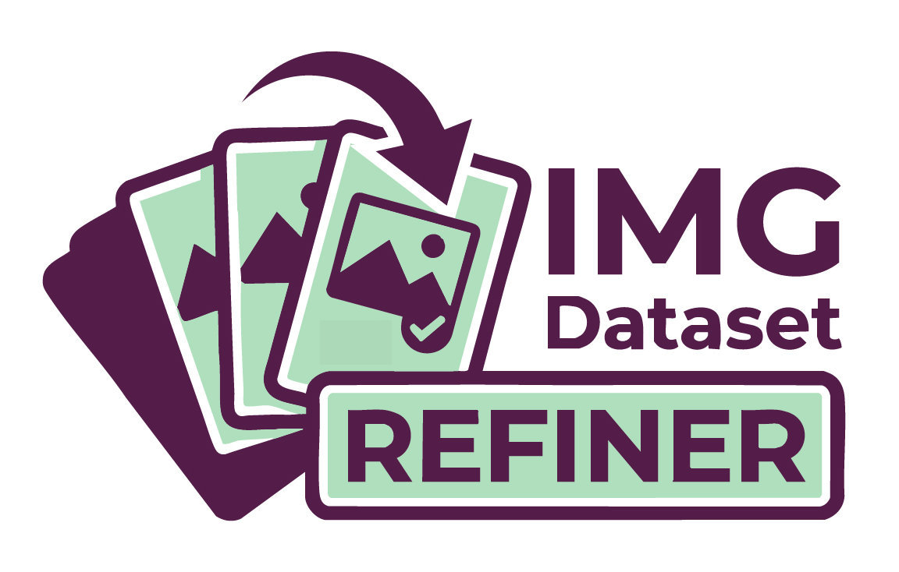

# IMG Dataset Refiner v4.3 Pro

<div align="center">
  

  <br>

  
  
  
  
  

  <p><strong>Desktop-style dataset manager for LoRA, Flux, SDXL and Stable Diffusion training workflows.</strong></p>

  <p>
    <a href="#preview">Preview</a> |
    <a href="#features">Features</a> |
    <a href="#installation">Installation</a> |
    <a href="#workflow">Workflow</a> |
    <a href="#ai-backends">AI Backends</a> |
    <a href="#developer-notes">Developer Notes</a>
  </p>
</div>

---

## Overview

**IMG Dataset Refiner** is a local Gradio application for building clean, balanced and training-ready image datasets. It helps you load folders of images and `.txt` captions, edit captions quickly, batch-apply keywords, pre-process images, detect duplicates, analyze dataset bias, and export curated subsets with balancing rules.

It is built for creators training:

- character, style, object and concept **LoRAs**;
- **Flux**, **SDXL**, Stable Diffusion and related image models;
- datasets requiring caption cleanup, translation, balancing and visual QA.

The app runs locally and can work with local AI servers such as **Ollama** and **LM Studio**, while also supporting OpenAI-compatible endpoints and cloud providers when configured.

---

## Preview


### Main Workspace


### AI Assistant


### Export & Recipe


### Advanced Analytics


---

## Features

### Dataset Loading

- Load datasets from local paths on any drive.
- Drag and drop folders or files into the app.
- Fallback folder-signature search when the browser hides absolute paths.
- Persistent favorites for frequently used datasets.
- Natural sorting: `img1`, `img2`, `img10`.
- Gradio `allowed_paths` support for external local folders.

### Caption Editing

- Fast visual gallery with persistent column preference.
- Image viewer with caption editor.
- Keyboard navigation with arrows and `PageUp` / `PageDown`.
- `Ctrl+S` save shortcut.
- Live word and token counters.
- Highlight tracked tags from the global recipe.
- Live translation preview and full-caption translation.

### Batch Editing

- Clean comma spacing.
- Remove duplicate tags.
- Apply keyword library items to a selection or the whole dataset.
- Add, remove or replace caption fragments at scale.
- Undo last batch operation.

### Custom Word Library

- Right-side mass-batch word library.
- Click-to-select custom HTML items.
- JavaScript bridge for reliable Gradio/Svelte synchronization.
- Add, remove and clear library entries.

### AI Assistance

- Local LLM/VLM actions through Ollama or LM Studio.
- OpenAI-compatible endpoint support.
- Cloud support for Anthropic Claude and Google Gemini.
- Auto-captioning / OCR with vision models.
- Reality check / hallucination cleanup.
- Concept isolator for LoRA subject separation.
- Tag sorting and standardization.
- Custom prompt templates.
- Dataset profiling report with compact tag statistics.
- AI-generated global recipe from existing captions.

### LM Studio Controls


- Refresh available LM Studio models.
- Favorite VLM and LLM model selectors.
- Shared model selector for using one model as both VLM and LLM.
- Load and unload model buttons.
- Persistent AI settings in `ai_settings.json`.

### Image Pre-processing

- Visual duplicate detection with `imagehash`.
- Smart face crop via OpenCV.
- Center square crop.
- Batch resize to common training resolutions.
- WebP / JPEG output.
- Transparent-background flattening for PNGs.
- Batch renaming for images and captions.

### Analytics

- General tag frequency table.
- CivitAI / Markdown statistics export.
- Top-20 recipe fill.
- Orphan tag detection.
- Co-occurrence heatmap.
- Resolution distribution plot.
- Exclusion matrix.
- Contradiction hunter.
- In-app explanations for reading analytics outputs.

### Export

- Classic filtering, auto-balancing and priority strategies.
- Greedy export algorithm for balanced subsets.
- Simulation before export.
- Versioned export folders based on the dataset name.
- Custom export suffix with `-Sx` / `-S1`, `-S2`, `-S3` behavior.

---

## Installation

### Windows One-click Install

1. Download or clone the repository.
2. Double-click `install.bat`.
3. Double-click `start.bat`.
4. The browser opens automatically.

### Manual Install

```bash
git clone https://github.com/NyxAwroo/IMG-Dataset-Refiner.git
cd IMG-Dataset-Refiner
python -m venv venv

# Windows
venv\Scripts\activate

# macOS / Linux
source venv/bin/activate

pip install -r requirements.txt
python lora_manager.py
```

---

## Workflow

1. **Load a dataset**
   - Paste a folder path, use Browse, drag and drop, or pick a favorite.

2. **Inspect and edit captions**
   - Use the gallery, viewer and caption editor.
   - Adjust gallery columns if needed; the setting is saved.

3. **Clean in batch**
   - Remove duplicate tags, normalize commas and apply word-library actions.

4. **Use AI selectively**
   - Generate captions, clean hallucinations, standardize tags or build a global recipe.

5. **Analyze**
   - Check tag frequencies, heatmaps, contradictions and resolution distribution.

6. **Simulate and export**
   - Tune the recipe table, simulate the result, then export a versioned clean dataset.

---

## AI Backends

| Backend | Use case | Notes |
| --- | --- | --- |
| Ollama | Local LLM/VLM workflows | Default local backend, no API key required. |
| LM Studio / OpenAI-compatible | Local GGUF or remote compatible APIs | Uses `/v1/chat/completions`. Model IDs must match the server. |
| Anthropic Claude | Cloud text and vision workflows | Requires an API key. |
| Google Gemini | Cloud text and vision workflows | Requires an API key. |

AI settings are stored in `ai_settings.json`.

---

## Project Structure

```text
IMG Dataset Refiner/
├── lora_manager.py              # Main application: UI, backend logic, custom JS bridge
├── requirements.txt             # Python dependencies
├── install.bat                  # Windows installer
├── start.bat                    # Windows launcher
├── Changelog.md                 # Release notes
├── Prompt_system.md             # Future-development handoff prompt
├── readme.md                    # GitHub documentation
├── SUGGESTIONS.md               # Optional improvement backlog
├── lora_recipes.json            # Saved global/export recipes
├── ai_settings.json             # Persistent AI backend/model settings
├── ui_settings.json             # Persistent UI preferences, including gallery columns
├── languages/
│   ├── fr.json                  # French UI strings
│   └── en.json                  # English UI strings
├── logotype/
│   └── logo.jpg                 # Logo used in README
└── screenshots demo/            # Place GitHub preview screenshots here
```

Generated files such as `favorites.json`, `ai_recipes.json` and export folders may appear after using the app.

---

## Languages

The UI is fully driven by JSON language files.

To add a language:

1. Copy `languages/fr.json` or `languages/en.json`.
2. Rename it, for example `de.json`, `es.json`, `it.json`.
3. Translate values while preserving keys.
4. Put it in `languages/`.
5. Restart the app.

You can also import a language JSON file directly from the in-app settings panel.

---

## Developer Notes

This project relies on a sensitive Gradio + JavaScript bridge. Before editing `lora_manager.py`, read `Prompt_system.md`.

Important stability rules:

- Do not pass `custom_js` through `launch(js=...)`.
- Keep the custom JavaScript injection through `app.load(..., js=custom_js)`.
- Do not combine `custom_js` and frontend component outputs in the same `app.load` event.
- Do not update `Gallery` from `app.load`; it can trigger Gradio/Svelte `flush` loops and freeze tabs.
- Keep hidden bridge components present in the DOM; Gradio may destroy components marked only as `visible=False`.
- Keep global JavaScript listeners narrow and guarded.
- Test tab switching after any JS, gallery, dataframe or `app.load` change.

---

## Requirements

Main dependencies include:

- `gradio`
- `pandas`
- `plotly`
- `Pillow`
- `requests`
- `deep-translator`
- `imagehash`
- `opencv-python`

See `requirements.txt` for the exact install list.

---

## License

Free to use and modify for personal and professional AI dataset workflows.

---

## Credits

Built for practical LoRA dataset preparation, local AI captioning, and fast caption cleanup workflows.
